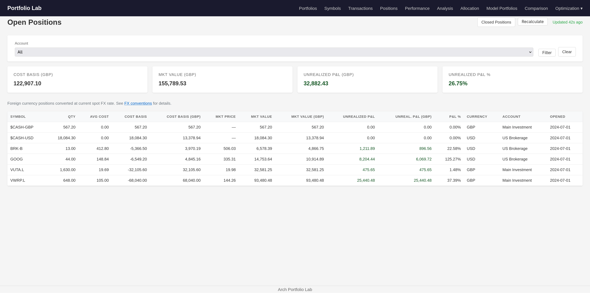
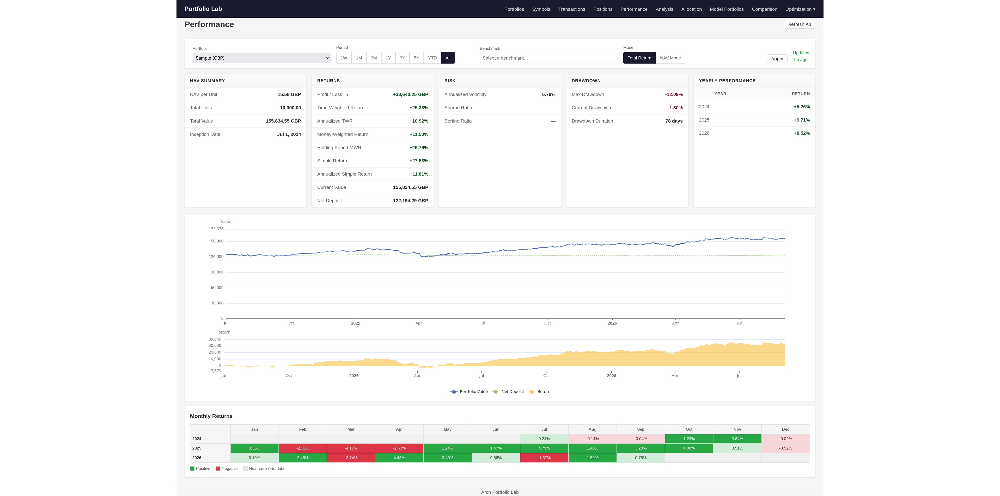

# Arch Portfolio Lab

A self-hosted, privacy-first investment portfolio management platform for personal investors: track stocks and ETFs across multiple accounts and currencies, with deep P&L analytics — no cloud, no third-party services.

Built spec-driven with AI coding agents — every feature ships with a portable, implementation-agnostic spec you can hand to your own AI agent to re-implement or customize (see [Development](#development-spec-driven-ai-agent-workflow)).

## Screenshots

| Open Positions | Performance |
|---|---|
|  | [](docs/images/performance.png) |

## Quickstart

No local build required — the published image is pulled from GHCR. Grab the
[compose file](compose.yaml) from the repo root and run it with Docker or Podman (Compose v2):

```bash
git clone https://github.com/eddiectc/portfoliolab.git
cd portfoliolab
docker compose up -d        # or: podman compose up -d
```

- Open **http://localhost:8080** — a recognizable "Sample" portfolio is seeded on first startup so the app demos itself; delete it from the UI to start clean.
- Data persists in the `portfoliolab-data` volume (single SQLite file).
- The app is single-user with **no built-in auth** — keep it on localhost or put a reverse proxy (e.g., Caddy with basic auth) in front.

Binary install, pinned image tags, env-var configuration, backups, and updates: [Deployment](docs/DEPLOYMENT.md).

## Features

Every feature is tracked in [features/](features/) with a spec, plan, and notes. Feature IDs in parentheses link back to `features/<id>_<name>/`.

### Tracking & Import

- [x] **Web Interface** — Server-rendered HTML (Go templates), responsive, with tables, charts, and heatmaps
- [x] **Portfolio & Account Management** — CRUD for portfolios (named groupings of accounts with a base currency) and brokerage accounts (e.g., "IBKR Main", "Trading 212 ISA") (f001, f002)
- [x] **Multi-Currency Support** — Accounts and transactions in different currencies; exchange rate tracking and conversion
- [x] **Transaction Entry** — Manual entry of buys, sells, deposits, withdrawals, dividends, fees, and transfers with filtering and pagination; unknown symbols can be created inline with a live market data preview (f004–f006)
- [x] **Broker Import** — IBKR Flex Report (XML) and Trading 212 (CSV) with symbol mapping, duplicate detection, and a preview before confirming (f007, f008)
- [x] **Positions** — Open positions across accounts with cost basis and unrealized P&L, closed positions with FIFO lot matching for realized P&L, and per-account cash balance (f009)

### Performance & Analysis

- [x] **Portfolio Performance** — Equity curve on a unitized NAV (cash-flow independent), time-weighted return (TWR), money-weighted return (MWR/IRR), simple return, annualized volatility, drawdown analysis (max/current/duration), yearly performance, period selector (f010, f013)
- [x] **Benchmark Comparison** — Overlay the S&P 500, NASDAQ, or any user-marked symbol on the performance chart; MWR side-by-side; monthly return heatmap (f012, f014)
- [x] **Portfolio Analysis** — ETF overlap, correlation matrix, sector & geographic allocation via ETF look-through, stress testing, factor exposure (f017)
- [x] **Allocation** — Current vs target weights per symbol, drift and rebalancing suggestions, per-account drill-down, cash included (f018)
- [x] **Model Portfolios** — Named allocation blueprints (symbols + % weights) that can be applied as a real portfolio's target allocation (f019)
- [x] **Portfolio Comparison** — Any two portfolios (model vs model, model vs real, real vs real) side-by-side: performance, risk, drawdown, return distribution, holdings/sector/country overlap with drift, cross-portfolio correlation, beta, alpha (f020, f027)
- [x] **Portfolio Optimization** — Efficient frontier (max Sharpe, min variance, etc.) and Hierarchical Risk Parity over a chosen set of assets, with results savable as a new model portfolio (f028, f029)

### Fund & Market Data

- [x] **Symbol Details** — Cached metadata per symbol: name, exchange, live price; for ETFs, top holdings, sector weightings, geographic allocation, and fund profile (f015, f016)
- [x] **Provider Data Extractors** — Richer fund data fetched directly from the fund provider (full holdings, NAV history, country/sector breakdowns, fund characteristics) for WisdomTree, DWS, Dimensional, iMGP (factsheet PDFs), Vanguard, and BlackRock/iShares (f021–f026)
- [x] **Historical Price Caching** — Daily stock and FX prices fetched and cached in the background so pages render instantly; manual refresh and status (f011)

### Supporting (minor)

- **Symbol Map** — Normalizes broker tickers to market-data symbols (Yahoo Finance by default) (f003)
- **Unitization** — Portfolio unitized like a fund (units and NAV per unit) so deposits/withdrawals don't distort performance (f013)
- **Benchmark Selection** — Any symbol can be marked as a benchmark, with automatic historical price caching and background refresh (f014)
- **Seed Data** — A recognizable sample portfolio on first startup so a fresh deployment is immediately demoable (f030)

### Planned (not yet implemented)

- [ ] **Generic CSV Import** — Column-mapping CSV import for transaction data (broker-specific imports already covered above)
- [ ] **Mobile App** — Leverage the API layer for a native mobile frontend
- [ ] **Additional Broker Imports** — Schwab, Fidelity, eToro, etc.
- [ ] **Tax Lot Tracking** — LIFO and specific-lot identification for tax reporting (FIFO matching already powers realized P&L)
- [ ] **Watchlist** — Track symbols not yet in the portfolio
- [ ] **Notifications** — Price alerts, portfolio milestones
- [ ] **Data Export** — Export portfolio data and reports

### Out of Scope

- **Trading execution** — This is a tracking tool, not a trading platform
- **Multi-user/multi-tenant** — Single-user personal tool
- **Authentication** — Self-hosted; rely on reverse proxy (e.g., Caddy with basic auth) for access control

## Development: Spec-Driven, AI-Agent Workflow

This repository is a working example of building real software **with AI coding agents, in a disciplined way**:

- **The specs are the source of truth.** Every feature lives in [`features/<id>_<name>/`](features/) as a BDD `SPEC.md` (user stories + scenarios, written implementation-agnostic), a `PLAN.md` (small, testable tasks), and `NOTES.md` / `RETRO.md` (decisions, deviations, lessons). A spec + plan is enough for a person *or an AI agent* to re-implement the feature from scratch.
- **Want a tool like this, customized to you?** You don't need to maintain this codebase. Take the specs you care about — or the whole `features/` directory — point your AI coding agent at them, and ask it to implement or adapt them to your own brokers, currencies, and analytics. The specs are the portable asset; the Go code is one implementation of them.
- **The workflow** is the [pi-agile-workflow](https://github.com/eddiectc/agentic_workflows/tree/main/pi-agile-workflow) skill set: an agile workflow designed for AI agents — `/write-spec` → human review → `/review-spec` → `/plan-impl` → human review → implement task-by-task with tests alongside → `/retro`. Humans stay in the loop at spec and plan review; the agent does the execution, one independently testable task at a time.

All 30 features above were built this way end-to-end — including in-place revisions when external dependencies change (see [features/README.md](features/README.md)).

## Documentation

- [Project Overview](docs/PROJECT.md) — problem statement, goals, non-goals, constraints, doc index
- [Coding Conventions](docs/CONVENTIONS.md) — style, naming, testing, domain, DB, API, web, security
- [FX Conventions](docs/FX_CONVENTIONS.md) — foreign exchange rate conventions
- [API Reference](API.md) — REST API endpoints, request/response schemas
- [Deployment](docs/DEPLOYMENT.md) — run as binary or container (Docker / Podman), published images on GHCR
- [Features](features/) — feature specs, plans, notes, retrospectives (revised in place; superseded versions archived in `vN/` subfolders)

## High-Level Architecture

```
┌──────────────────────────────────────────────────────────────┐
│                        Web Browser                            │
│         (Server-rendered HTML pages + JS charts/tables)       │
└──────────────────────────────┬───────────────────────────────┘
                               │ HTTP/REST
┌──────────────────────────────▼───────────────────────────────┐
│                  Go Backend (Single Binary)                   │
│                                                               │
│  ┌───────────┐  ┌───────────┐  ┌──────────────┐ ┌─────────┐ │
│  │  HTTP     │  │  HTML     │  │  Import      │ │ Market  │ │
│  │  API      │  │  Renderer │  │  Parsers     │ │ Data    │ │
│  │  Routes   │  │  (Pages)  │  │  (CSV, XML)  │ │ Fetcher │ │
│  └─────┬─────┘  └─────┬─────┘  └──────┬───────┘ │(yfinance)│ │
│        │              │                │         └────┬────┘ │
│  ┌─────▼──────────────▼────────────────▼──────────────▼────┐ │
│  │                   Domain Layer                           │ │
│  │  Portfolio │ Account │ Transaction │ Position │ Analytics│ │
│  │  P&L Calc  │ Cash    │ Import      │ Currency │ Bench   │ │
│  └─────┬───────────────────────────────────────────────────┘ │
│        │                                                     │
│  ┌─────▼───────────────────────────────────────────────────┐ │
│  │                   Data Layer                             │ │
│  │  SQLite (single file, WAL mode)                          │ │
│  └──────────────────────────────────────────────────────────┘ │
└──────────────────────────────────────────────────────────────┘
```

### Key Design Decisions

1. **Single Go binary** — Migrations, templates and static assets are embedded via `go:embed`; deployment is just the binary
2. **API-first** — All web pages consume the same API; enables future mobile app
3. **Server-rendered pages** — No SPA complexity; pages are fast and simple
4. **No auth in the app** — Rely on infrastructure (reverse proxy) for security
5. **SQLite** — Single-user tool; no DB server process, single file, WAL mode for concurrent reads, pure Go driver (`modernc.org/sqlite`)
6. **go-yfinance for market data** — Fetches stock/ETF prices and benchmark data via `github.com/wnjoon/go-yfinance` (pure Go, no Python dependency)
7. **Benchmarks** — S&P 500 (^GSPC), NASDAQ Composite (^IXIC), and user-defined custom benchmarks

## Tech Stack

| Component | Choice | Rationale |
|---|---|---|
| **Language** | Go | Single binary, fast, great for data processing, self-hosting friendly |
| **Web Framework** | `chi` or std `net/http` | Minimal routing; chi adds middleware support |
| **HTML Templating** | `html/template` (std) | Built-in, secure against XSS, no build step |
| **Database** | SQLite (`modernc.org/sqlite`) | Single file, no server, WAL mode, pure Go (no CGO) |
| **Queries** | `sqlc` | Type-safe SQL; generates Go types from queries |
| **Migrations** | `goose` (SQL migrations) | Versioned .sql migration files, SQLite driver |
| **Charts** | Apache ECharts | Excellent financial charting (candlestick, heatmap, waterfall), interactive |
| **Tables** | Plain HTML + DataTables.js | Sortable, searchable, paginated tables with minimal JS |
| **Heatmaps** | ECharts heatmap series | For sector/currency/allocation visualization |
| **CSV Parsing** | `encoding/csv` (std) | Built-in, reliable |
| **XML Parsing** | `encoding/xml` (std) | For IBKR flex reports |
| **Market Data** | `github.com/wnjoon/go-yfinance` | Pure Go yfinance client, no Python dependency |
| **Config** | YAML config file | Simple, no env var sprawl |
| **Logging** | `slog` (std) | Structured logging, built into Go 1.21+ |
| **Unit Testing** | `testing` (std) + hand-written mocks | Minimal mock structs in `*_test.go`; Arrange-Act-Assert |
| **Integration Testing** | In-memory SQLite + httptest | Real SQL, real schema, isolated per test |
| **Build** | Makefile | Simple build targets |
| **Deployment** | Docker (optional) + binary | Run directly or containerized |

## Required Tools

| Tool | Install |
|---|---|
| **Go** (1.21+) | https://go.dev/doc/install |
| **sqlc** | `go install github.com/sqlc-dev/sqlc/cmd/sqlc@latest` |
| **goose** | `go install github.com/pressly/goose/v3/cmd/goose@latest` |
| **goimports** | `go install golang.org/x/tools/cmd/goimports@latest` |

## Testing Strategy

### Unit Tests (co-located with source: `*_test.go`)
- **Scope**: Pure domain logic — P&L calculations, position aggregation, currency conversion, import parsing, benchmark math
- **Approach**: Hand-written mocks — minimal mock structs co-located in `*_test.go` files, simulating real repository behavior
- **Pattern**: Arrange-Act-Assert; table-driven tests (`[]struct{name, input, want}`)
- **Target**: 80%+ coverage on `internal/domain/`
- **No DB, no network** — unit tests run fast and deterministically

### Integration Tests (`tests/integration/`)
- **Scope**: Repository layer + domain services together; API handlers with `httptest`
- **Approach**: In-memory SQLite (`file::memory:?cache=shared`) with real schema via goose migrations
- **Isolation**: Each test gets a fresh in-memory DB; run migrations before each test
- **No mocking** — test the real SQL and real data flow

### API E2E Tests (`tests/e2e/api/`)
- **Scope**: Full HTTP request → response cycle through real routes
- **Approach**: Start the real router with in-memory DB; hit endpoints via `httptest.NewServer`
- **Assertions**: HTTP status codes, JSON response shapes, content-type headers

### Web UI Tests
- **Scope**: Minimal — template rendering only (no browser E2E)
- **Rationale**: Server-rendered pages are thin wrappers around API data; if the API is correct and templates compile, the UI is correct
- **Optional**: Add a few `html/template` rendering tests to verify no panics on edge-case data

### Other Tests
- **Import parsing**: Fixture-driven with real (anonymized) broker export files
- **Market data**: Mock go-yfinance responses; test price parsing and benchmark calculations
- **Tools**: `testing` (std), hand-written mocks (no testify/mockery)

## Definition of Done

- [ ] All feature specs implemented (see [features/](features/))
- [ ] Unit tests passing at 80%+ coverage on domain layer
- [ ] Integration tests passing for all API endpoints
- [ ] Import parsers tested against real broker file samples
- [ ] P&L calculations verified against known-correct spreadsheets
- [ ] Configuration documented (config.example.yaml)
- [ ] README.md complete with setup instructions
- [ ] Database migrations idempotent and documented (via goose)
- [ ] Market data fetching works (go-yfinance, prices cached)
- [ ] Single binary builds cleanly with `go build`
- [ ] No critical bugs in position calculation or P&L analysis

## Risks & Mitigations

| Risk | Impact | Mitigation |
|---|---|---|
| P&L calculation bugs | High — wrong numbers erode trust | Extensive unit tests + manual verification against spreadsheet |
| IBKR flex report schema changes | Medium — import breaks | Version detection in XML parser; graceful degradation |
| Multi-currency edge cases | Medium — rounding errors | Use integer arithmetic (minor units) internally; document rounding rules |
| go-yfinance API changes | Medium — upstream Yahoo Finance changes | Version-pin the library; graceful fallback if fetch fails |
| SQLite concurrency | Low — single user | WAL mode; single writer pattern (sequential imports) |
| Performance with large histories | Low — personal use | Index optimization; paginate queries; defer heavy analytics |
